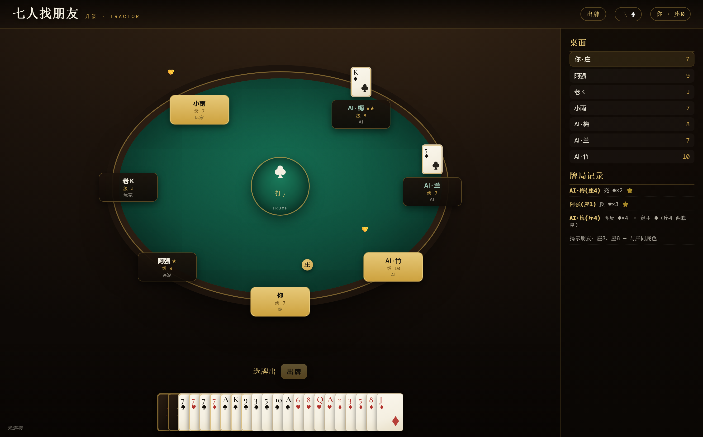

# 七人找朋友（六副牌 · 升级）

一个 **7 人、6 副牌**的「找朋友」式升级（拖拉机）纸牌游戏。真人在线对战，缺人由**强电脑 AI** 补位，断线自动托管、重连回座。

出牌规则同传统升级，特色在于：
- **流动队友**：每局庄家通过「叫 A」临时找 2 名朋友（可能叫到自己或同一人，所以叫牌是门技巧）。
- **6 副牌**：每人 45 张、底牌 9 张；每花色每点数各 6 张。
- **各打各的级**：每人有自己的级，从 7 起打，**J、A 必打**。



## 玩法要点

- **叫朋友**：庄家叫「第 N 张 + 某花色 + A」（打 A 那局改叫 K）。谁打出对应那张，谁就是朋友；揭示瞬间公开。
- **亮主 / 反底**：手持任意两王 + 一张级牌即可亮主；级牌张数定强弱，同张数按 **黑 > 红 > 梅 > 方**；反底**只换主与底、不换庄**，且反主必须换花色。亮主轮从庄家起，弃权即失去本局反主权。
- **必打**：升级走到 J、A 必须真在庄队赢下那局才算过，不可越过。
- **计分**：5 = 5 分、10 = 10 分、K = 10 分（全场 600 分）。闲家抓分 **恰好 0 = 大光（庄队 +3）/ 有分且 < 120 = 小光（+2）/ 120–239 = 过关（+1）/ ≥ 240 = 闲家上台**。
- **抠底**：闲家赢末墩翻底加分，倍数 = 2^(末墩出牌张数)；庄家赢末墩为保底。
- **坐庄**：首局随机，之后按固定座位轮庄，下台的庄队座位跳过。

## 技术架构

三块解耦、共用同一套规则真理源：

| 模块 | 说明 |
|------|------|
| `engine/` | **规则引擎**（TypeScript，纯函数，零运行时依赖）。发牌 / 主牌大小序 / 亮主反底 / 叫朋友 / 出牌合法性 / 比墩 / 计分抠底 / 升降级，全量单元测试。 |
| `server/` | **对局服务器**（Node + 原生 WebSocket）。注册登录、单桌 7 座、交互式对局状态机、**强 AI**（记牌记忆 + 启发式策略 + 残局蒙特卡洛搜索）、掉线托管与重连、SQLite 持久化。 |
| `client/` | **网页客户端**（单文件，零构建）。牌桌 / 理牌 / 亮主·扣底·叫朋友·出牌交互 / 计分与结算 / 亮主星标 / 庄队反色。 |

- **强 AI**：前中盘用启发式（按"控制权"出牌、智能叫朋友、保分），残局用**不完全信息蒙特卡洛搜索**（对未知手牌做决定化采样、模拟到局终取期望最优）。
- 服务端**对每个动作用引擎重新校验**，绝不信任客户端（反作弊），手牌按座位隔离。

## 目录结构

```
engine/   规则引擎（TS 包，npm test 可跑全部规则单测）
server/   对局服务器（TS 包，esbuild 打成单文件可部署）
client/   网页客户端（client/index.html）
docs/     文档与截图
```

## 快速开始（本地）

要求 **Node ≥ 22**（用到内置 `node:sqlite`，零原生依赖、免编译）。

```bash
# 1. 安装服务端依赖并打包
cd server
npm install
npm run build          # 用 esbuild 把 server + engine 打成 dist/server.mjs

# 2. 启动（指向客户端页面）
CLIENT_HTML=../client/index.html PORT=5080 node --experimental-sqlite dist/server.mjs

# 3. 浏览器打开 http://localhost:5080 → 注册 → 进牌室 → 开局
#    缺的座位自动由电脑补满
```

## 部署（生产）

详见 [`deploy/部署说明.md`](deploy/部署说明.md)：Ubuntu + nginx 反向代理（含 WebSocket 升级）+ systemd 守护。示例配置在 `deploy/` 下。

## 测试

```bash
cd engine && npm install && npm test    # 规则引擎全部单测
cd server && npm install && npm test    # 服务端 + 强 AI（含多局鲁棒性回归）
```

---

规则真理源驱动开发，全程测试先行。欢迎自建对局、研究 AI 策略。
